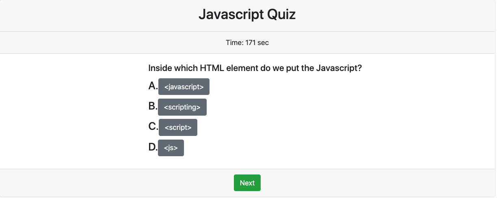

# Web APIs: Code Quiz
  [](https://opensource.org/licenses/MIT)


## Table of Contents
  - [Description](#description)
  - [User Story](#userstory)
  - [Installation](#installation)
  - [Built With](#built-with)
  - [License](#license)
  - [Questions](#questions)


## Description
Build a timed code quiz with multiple-choice questions. This app will run in the browser and feature dynamically updated HTML and CSS powered by your JavaScript code. It will also feature a clean and polished user interface and be responsive, ensuring that it adapts to multiple screen sizes.

The following animation demonstrates the application functionality:



## User Story
```
AS A coding bootcamp student
I WANT to take a timed quiz on JavaScript fundamentals that stores high scores
SO THAT I can gauge my progress compared to my peers
```
## Installation 
- Clone the GitHub repository
- Right click the file index.html and select "open with live server"

## Built With
- [VScode](https://code.visualstudio.com/) - Editor of choice

## License
MIT License

## Questions
- Github: https://github.com/Monicarangel95


